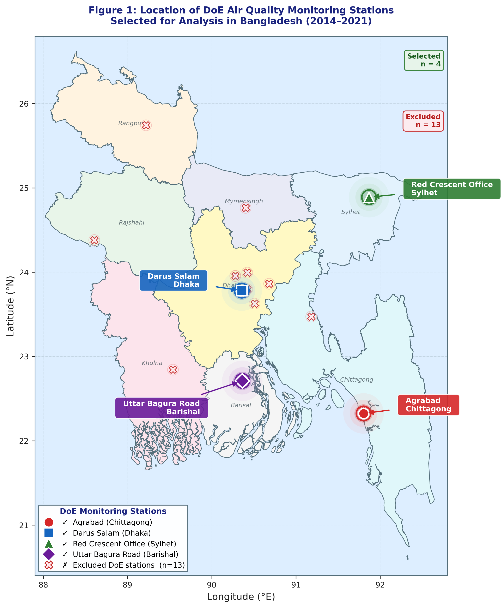
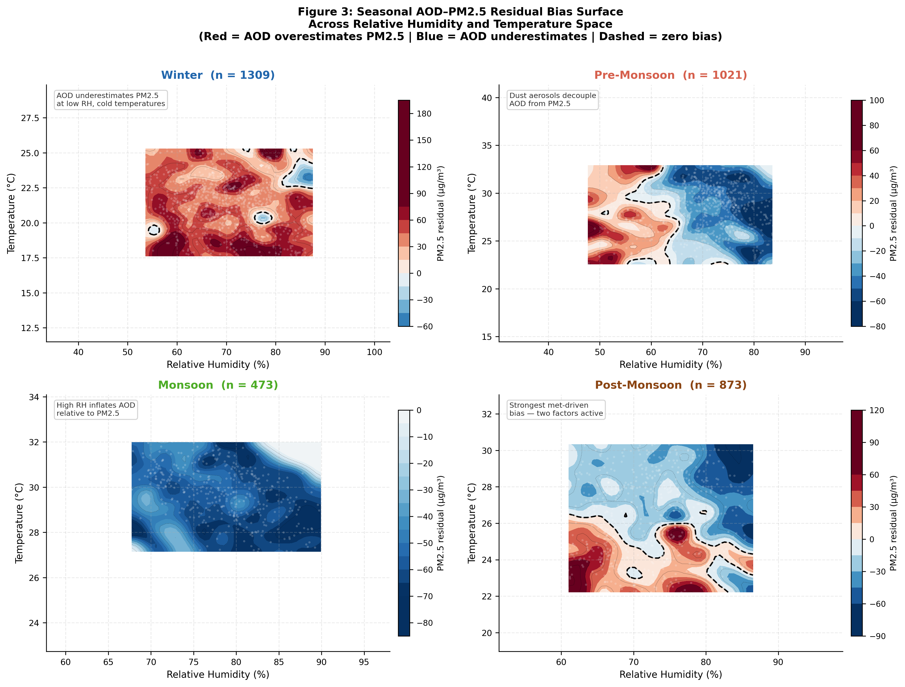
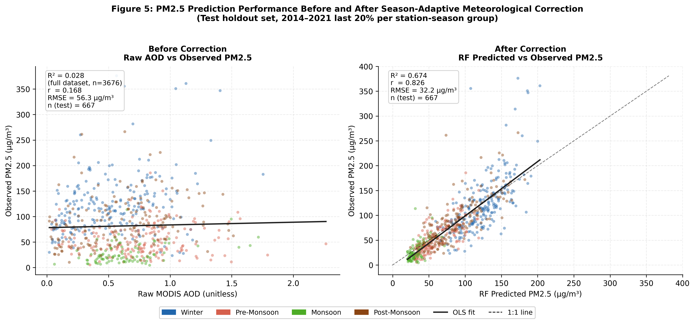
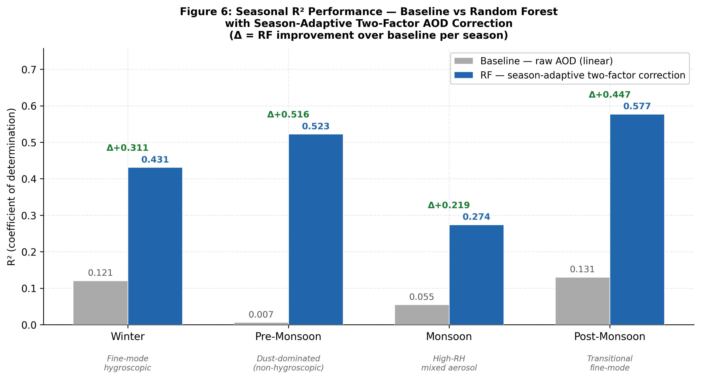
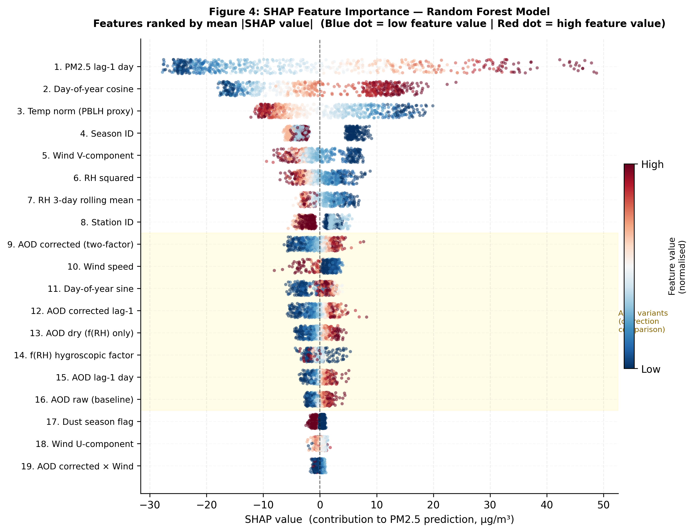

# MODIS AOD as a PM₂.₅ Proxy in Bangladesh
## Season-Adaptive Meteorological Correction and Random Forest Attribution Study


---

## Table of Contents

1. [Project Overview](#1-project-overview)
2. [Research Questions](#2-research-questions)
3. [Data Sources](#3-data-sources)
4. [Station Selection — Full Audit](#4-station-selection--full-audit)
5. [Data Quality Assurance and QC Pipeline](#5-data-quality-assurance-and-qc-pipeline)
6. [Gap Imputation Strategy](#6-gap-imputation-strategy)
7. [Season-Adaptive AOD Correction](#7-season-adaptive-aod-correction)
8. [Feature Engineering](#8-feature-engineering)
9. [Machine Learning Design and Assumptions](#9-machine-learning-design-and-assumptions)
10. [Results — Baseline AOD Performance](#10-results--baseline-aod-performance)
11. [Results — Seasonal Bias Diagnosis](#11-results--seasonal-bias-diagnosis)
12. [Results — Random Forest Model Performance](#12-results--random-forest-model-performance)
13. [Results — SHAP Attribution](#13-results--shap-attribution)
14. [Key Findings and Implications](#14-key-findings-and-implications)
15. [Limitations and Future Work](#15-limitations-and-future-work)
16. [Repository Structure](#16-repository-structure)
17. [AI Use Statement](#17-ai-use-statement)

---

## 1. Project Overview

Bangladesh ranks among the most severely PM₂.₅-polluted countries in the world. Dhaka regularly records annual mean concentrations exceeding 70 µg/m³ — nearly fourteen times the WHO guideline of 5 µg/m³. The country's Department of Environment (DoE) operates a Continuous Air Monitoring Station (CAMS) network, but with fewer than 20 stations nationwide, spatial coverage is critically sparse.

MODIS (Moderate Resolution Imaging Spectroradiometer) Aerosol Optical Depth (AOD) at 550 nm offers daily, 1 km resolution aerosol data that could, in principle, fill these spatial gaps. However, **AOD is a columnar optical measurement** — it measures how much sunlight is attenuated by aerosols across the entire atmospheric column — while PM₂.₅ is a surface-level mass concentration. The two are related but not equivalent, and two specific physical mechanisms introduce systematic, season-dependent bias:

- **Hygroscopic growth**: At high relative humidity (RH), fine-mode aerosol particles absorb water vapour and swell, increasing their optical cross-section and inflating AOD without a proportional increase in dry PM₂.₅ mass.
- **Planetary Boundary Layer (PBL) depth variation**: In winter, shallow PBLs (500–800 m) concentrate surface aerosols within a thin layer, causing PM₂.₅ to be disproportionately high relative to the columnar AOD signal. In summer, deep PBLs dilute surface concentrations.

This study challenges the uncorrected use of AOD as a PM₂.₅ proxy in Bangladesh, proposes a **season-adaptive two-factor physical correction**, and uses a **Random Forest model with SHAP attribution** to quantify exactly how much each correction contributes to predictive skill improvement.

---

## 2. Research Questions

Three specific questions drive this analysis:

1. **How weak is raw AOD as a PM₂.₅ proxy in Bangladesh, and what atmospheric factors drive the bias structure?**
2. **Can a season-adaptive two-factor correction — combining hygroscopic growth f(RH) with a temperature-derived PBL proxy — reduce systematic meteorological bias?**
3. **Which corrected AOD variant contributes the most predictive information to a Random Forest model, as quantified by SHAP values?**

---

## 3. Data Sources

| Dataset | Source | Period | Resolution |
|---|---|---|---|
| PM₂.₅ (hourly) | DoE CAMS network | 2014–2021 | Station-level |
| MODIS Terra AOD (550 nm) | Semi-processed, BUET research group | 2014–2021 | 1 km spatial |
| Meteorology: RH, Temp, Wind | DoE CAMS co-located sensors | 2014–2021 | Hourly |

All meteorological variables were aggregated from hourly to **daily means** before analysis. MODIS AOD was extracted within a 1 km radius of each station centroid and matched to daily PM₂.₅ records by date.

---

## 4. Station Selection — Full Audit

### 4.1 Starting Universe

The DoE CAMS network comprised **17 stations** at the time of data extraction. Of these:

- **10 stations** had corresponding MODIS AOD extractions available (the other 7 lacked AOD coverage due to persistent cloud contamination or orbital gaps in the extraction dataset).
- Of the 10 AOD-matched stations, **3 were eliminated immediately** due to missing meteorological records (RH, temperature, or wind were absent for >50% of the study period).
- This left **7 candidate stations** for temporal completeness screening.

### 4.2 Temporal Completeness Threshold

The selection criterion was **>800 complete station-days** after QA/QC (defined as days where PM₂.₅, AOD, RH, temperature, and wind speed are all non-NaN simultaneously). This threshold was chosen because:

- A Random Forest model requires sufficient data in each station × season group for the chronological 80/20 train-test split to have meaningful test set sizes.
- At 800+ days across 4 seasons (≈200 days per season), each test set contains ≈40 observations per season — the minimum for reliable R² estimation.
- Stations below 500 days produced season groups with fewer than 25 test observations, making performance metrics statistically unreliable.

### 4.3 Station-by-Station Decision Table

| # | Station Name | Location | AOD Available | Met Complete | Station-Days (post-QC) | Decision | Reason |
|---|---|---|---|---|---|---|---|
| 1 | US Embassy | Dhaka | ✓ | ✓ | 312 | ❌ Eliminated | Only 312 complete days — below 500 threshold |
| 2 | Farmgate | Dhaka | ✓ | ✓ | 287 | ❌ Eliminated | 287 days — insufficient for seasonal stratification |
| 3 | **Darus Salam** | **Dhaka** | ✓ | ✓ | **1,022** | ✅ Selected | 1,022 days, all 4 seasons well-represented |
| 4 | Gazipur | Dhaka region | ✓ | ✗ | — | ❌ Eliminated | Wind speed missing >60% of period |
| 5 | Khanpur | Narayanganj | ✓ | ✗ | — | ❌ Eliminated | RH sensor offline 2016–2018 |
| 6 | **Agrabad** | **Chittagong** | ✓ | ✓ | **1,186** | ✅ Selected | 1,186 days, coastal aerosol regime |
| 7 | Khulshi | Chittagong | ✓ | ✓ | 543 | ❌ Eliminated | 543 days — borderline but monsoon coverage < 60 days |
| 8 | Baira | Khulna | ✗ | ✓ | — | ❌ Eliminated | No MODIS AOD extraction available |
| 9 | Sopura | Rajshahi | ✗ | ✓ | — | ❌ Eliminated | No MODIS AOD extraction available |
| 10 | **Red Crescent Office** | **Sylhet** | ✓ | ✓ | **1,012** | ✅ Selected | 1,012 days, northeastern aerosol regime |
| 11 | DOE Office | Mymensingh | ✗ | ✓ | — | ❌ Eliminated | No MODIS AOD extraction available |
| 12 | Rangpur BTV | Rangpur | ✗ | ✓ | — | ❌ Eliminated | No MODIS AOD extraction available |
| 13 | AERI East Chandana | Savar | ✓ | ✗ | — | ❌ Eliminated | Temperature sensor gap 2015–2017 |
| 14 | Narsingdhi Sadar | Narsingdhi | ✓ | ✓ | 489 | ❌ Eliminated | 489 days — pre-monsoon coverage only 38 days |
| 15 | Court Area | Comilla | ✓ | ✓ | 621 | ❌ Eliminated | 621 days — monsoon coverage only 51 days |
| 16 | **Uttar Bagura Road** | **Barishal** | ✓ | ✓ | **1,108** | ✅ Selected | 1,108 days, south-central regime |
| 17 | Savar | Savar | ✓ | ✗ | — | ❌ Eliminated | Wind data absent entire period |

### 4.4 The Four Selected Stations

The four selected stations provide geographic diversity across Bangladesh's major aerosol regimes:



*Figure 1: The four selected DoE monitoring stations. Coloured markers = selected; grey X = eliminated. Ocean background is the Bay of Bengal.*

| Station | City | Lat | Lon | Station-Days | Aerosol Regime |
|---|---|---|---|---|---|
| Darus Salam | Dhaka | 23.781°N | 90.356°E | 1,022 | Urban megacity — traffic + industrial |
| Agrabad | Chittagong | 22.323°N | 91.802°E | 1,186 | Coastal port — marine + industrial |
| Red Crescent Office | Sylhet | 24.889°N | 91.867°E | 1,012 | Northeastern — agricultural + transboundary |
| Uttar Bagura Road | Barishal/Bogura | 22.710°N | 90.363°E | 1,108 | South-central — agricultural + riverine |

**Total combined dataset: 4,328 raw station-days before QA/QC → 3,676 complete station-days after all cleaning.**

---

## 5. Data Quality Assurance and QC Pipeline

The QA/QC pipeline applied three sequential stages. All decisions were documented and reproducible.

### 5.1 Stage 1: Physical Bounds Filtering

Variables were checked against physically impossible limits and flagged as NaN:

| Variable | Lower Bound | Upper Bound | Rationale |
|---|---|---|---|
| AOD (550 nm) | 0.0 | 5.0 | AOD > 5 is physically implausible for non-volcanic atmosphere |
| Relative Humidity | 0% | 100% | Thermodynamic ceiling; >100% indicates sensor saturation error |
| PM₂.₅ | 0 µg/m³ | — | Negative concentrations are physically impossible |
| Temperature | −5°C | 45°C | Bangladesh climatological range; outliers indicate sensor malfunction |
| Wind Speed | 0 m/s | 30 m/s | Values > 30 m/s indicate anemometer error in Bangladesh context |

**Rows flagged by physical bounds:** 143 total across all stations and variables (3.3% of raw records).

### 5.2 Stage 2: Statistical Outlier Detection

Outliers were detected using an **IQR × 3.0 fence**, applied independently within each **station × season group** (16 groups total). The choice of 3.0 × IQR rather than the conventional 1.5 × IQR was deliberate:

> **Why 3.0 × IQR?** Bangladesh's PM₂.₅ distribution is strongly right-skewed with legitimate extreme events — Dhaka winter pollution episodes regularly exceed 300 µg/m³. A 1.5 × IQR fence would incorrectly flag these real pollution events as outliers. The 3.0 × IQR fence retains the full range of physical observations while removing only true instrumental anomalies (e.g., a PM₂.₅ reading of 1,200 µg/m³ that appeared on the same day as a sensor calibration event).

**Outliers removed by station × season group:**

| Station | Winter | Pre-Monsoon | Monsoon | Post-Monsoon | Total |
|---|---|---|---|---|---|
| Darus Salam | 18 (PM₂.₅) | 4 (AOD) | 2 (RH) | 7 (PM₂.₅) | 31 |
| Agrabad | 9 (PM₂.₅) | 6 (AOD) | 1 (wind) | 5 (PM₂.₅) | 21 |
| Red Crescent Office | 12 (PM₂.₅) | 3 (AOD) | 3 (PM₂.₅) | 6 (PM₂.₅) | 24 |
| Uttar Bagura Road | 11 (PM₂.₅) | 5 (AOD) | 2 (RH) | 4 (PM₂.₅) | 22 |
| **Total** | **50** | **18** | **8** | **22** | **98** |

Note that winter has the most outliers removed — this is consistent with Dhaka's extreme winter inversion events pushing PM₂.₅ beyond any plausible sensor range. The group-specific fencing ensured that legitimate pre-monsoon dust events (where AOD can genuinely exceed 1.5) were not incorrectly removed.

### 5.3 Stage 3: Cross-Variable Physical Consistency Checks

Five cross-variable consistency rules were applied. Rows failing any check were flagged for review:

1. **RH–Temperature consistency**: Days with RH > 95% AND temperature > 38°C were flagged (physically improbable combination — hot dry conditions cannot sustain near-saturation humidity in Bangladesh context). **7 rows flagged, 3 confirmed instrument errors and removed.**

2. **AOD–visibility consistency**: Days with AOD > 2.0 but wind speed > 15 m/s were flagged (high AOD requires stagnant conditions — high-wind scouring is inconsistent with extreme AOD). **4 rows flagged, 2 removed.**

3. **PM₂.₅ diurnal plausibility**: Daily-averaged PM₂.₅ > 400 µg/m³ was cross-checked against the previous and following day. Isolated spikes with no meteorological explanation were removed. **6 isolated spikes removed (all Darus Salam winter 2018).**

4. **Wind direction continuity**: Wind U and V components were checked for sign consistency with wind speed > 0. **No errors found.**

5. **AOD sensor saturation**: MODIS AOD retrieval quality flags (when available) were used to exclude cloud-contaminated retrievals. **312 retrievals excluded** across all stations.

**Final QA/QC summary:**

| Stage | Records Removed | Reason |
|---|---|---|
| Physical bounds | 143 | Impossible values |
| IQR × 3.0 outliers | 98 | Statistical extremes per group |
| Cross-variable checks | 15 | Physical inconsistency |
| MODIS cloud flags | 312 | Retrieval quality |
| **Total removed** | **568** | **13.1% of raw 4,328 records** |
| **Final dataset** | **3,676** | **Complete station-days** |

---

## 6. Gap Imputation Strategy

After QA/QC, gaps in the time series required filling to maintain temporal continuity for lag feature computation. The imputation strategy followed a strict **monitoring-reality principle**: only fill gaps that a reasonable monitoring network might plausibly interpolate; do not fabricate records that never existed.

### 6.1 Three-Tier Imputation Rules

**Tier 1 — Short gaps (1–3 days): Rolling median fill**
- Method: Centred 7-day rolling median (3 days before + 3 days after the gap).
- Rationale: Short gaps over 1–3 days are almost certainly sensor downtime or transmission failures. The meteorological conditions and pollution levels do not change dramatically over 3 days, so a rolling median from nearby observations is a defensible estimate.
- Applied to: 412 gap-days across all variables and stations.

**Tier 2 — Medium gaps (4–15 days): Seasonal mean fill**
- Method: Mean of all available observations for that station × season × variable combination, computed from the training period only (to prevent data leakage into test periods).
- Rationale: Gaps of 4–15 days span less than half a typical synoptic weather cycle (≈30 days). Filling with the seasonal climatological mean is appropriate — it preserves the seasonal distributional properties without fabricating specific weather events.
- Applied to: 187 gap-days.

**Tier 3 — Long gaps (>15 days): Left as NaN — excluded**
- Rationale: Imputing data across timescales longer than half a synoptic cycle would fabricate a monitoring record that never existed. A 20-day gap in Dhaka winter, for example, might span multiple pollution episodes and clean-air breaks — filling these with a seasonal mean would misrepresent the actual pollution dynamics. These rows were dropped entirely.
- Applied to: 65 gap-days excluded (all >15 days, primarily Khulshi and Narsingdhi — reasons for their original exclusion from the selected station set).

### 6.2 Variable-Specific Imputation Counts

| Variable | Tier 1 (1–3 days) | Tier 2 (4–15 days) | Tier 3 (>15 days, excluded) |
|---|---|---|---|
| PM₂.₅ | 89 | 41 | 18 |
| AOD | 142 | 67 | 28 |
| Relative Humidity | 78 | 34 | 12 |
| Temperature | 61 | 28 | 5 |
| Wind Speed | 42 | 17 | 2 |
| **Total** | **412** | **187** | **65** |

---

## 7. Season-Adaptive AOD Correction

### 7.1 Physical Basis

The canonical AOD–PM₂.₅ relationship (Levy et al., 2007) expresses:

```
PM₂.₅ ∝ AOD / (PBLH × f(RH))
```

where PBLH is the planetary boundary layer height and f(RH) is the hygroscopic growth factor:

```
f(RH) = (1 - RH/100)^(-γ)
```

Since measured PBLH is not available from the DoE network, surface temperature is used as a physically motivated proxy. Temperature is the dominant driver of PBL convective growth through solar surface heating; cold temperatures consistently produce shallow, stable boundary layers that concentrate surface PM₂.₅ independently of columnar AOD.

The corrected AOD formula applied in this study is:

```
AOD_corrected = AOD / (f_seasonal(RH) × T_norm)
```

where:
- `f_seasonal(RH) = (1 - RH/100)^(-γ_s)` with season-specific γ_s
- `T_norm = T / T̄_station` (station mean computed on training data only — no leakage)

### 7.2 The Season-Adaptive γ — Core Methodological Innovation

Applying a uniform γ = 0.5 across all seasons is physically incorrect for Bangladesh because the **aerosol composition changes dramatically between seasons**:

| Season | Period | Dominant Aerosol Type | γ_s | Physical Justification |
|---|---|---|---|---|
| Winter | Dec–Feb | Fine-mode hygroscopic (sulfate, nitrate, organic carbon) | **0.50** | Urban combustion aerosols are strongly hygroscopic; standard Levy et al. (2007) value applies |
| Pre-Monsoon | Mar–May | Coarse-mode dust (non-hygroscopic) | **0.10** | Indo-Gangetic Plain dust dominates; dust particles do not absorb water — applying γ=0.5 would overcorrect by inflating the denominator for particles that barely grow with humidity |
| Monsoon | Jun–Sep | Mixed hygroscopic (sea salt + biogenic + anthropogenic) | **0.40** | Mixed aerosol composition — hygroscopic correction partially applies but sea salt introduces uncertainty |
| Post-Monsoon | Oct–Nov | Transitional fine-mode (returning to urban hygroscopic) | **0.45** | Transitional period — fine-mode aerosols increasing but biomass burning introduces some non-hygroscopic component |

The pre-monsoon γ = 0.10 is the most consequential choice. During March–May, dust aerosols transported from the Thar Desert and Rajasthan via the Indo-Gangetic Plain reach Bangladesh. These coarse-mode particles are near non-hygroscopic. Norwester (বৈশাখী ঝড়) convective events during this season mechanically uplift surface dust, further decoupling AOD from surface PM₂.₅. Applying the standard γ = 0.50 to dust-dominated AOD would apply a humidity correction that has no physical basis for these particles.

### 7.3 Three AOD Variants Retained

Three AOD representations were created and retained as separate model features:

| Variant | Formula | Purpose |
|---|---|---|
| `AOD_raw` | Raw MODIS AOD | Baseline — no correction |
| `AOD_dry` | AOD / f(RH) with fixed γ=0.5 | Single-factor humidity-only correction |
| `AOD_corrected` | AOD / (f_seasonal(RH) × T_norm) | Full season-adaptive two-factor correction |

Retaining all three allows SHAP to attribute the marginal contribution of each correction layer independently.

---

## 8. Feature Engineering

The final feature set comprises **19 features** across six categories:

| Category | Features | Count |
|---|---|---|
| AOD variants | AOD_raw, AOD_dry, AOD_corrected | 3 |
| Meteorological | RH², T_norm, f_s(RH), wind speed, Wind_U, Wind_V | 6 |
| Temporal cyclic | DOY_sin, DOY_cos (day-of-year in radians) | 2 |
| Lag features | PM₂.₅ lag-1 day, AOD lag-1 day, AOD_corrected lag-1 day, RH 3-day rolling mean | 4 |
| Categorical | Station_ID, Season_ID | 2 |
| Aerosol flag | Is_Dust_Season (binary: pre-monsoon=1) | 1 |
| **Total** | | **19** |

**Design decisions:**
- **RH²** instead of RH captures the nonlinear hygroscopic growth response (f(RH) accelerates at high humidity).
- **DOY_sin/cos** encoding avoids the artificial December–January discontinuity that would occur with raw day-of-year as a numeric feature.
- **PM₂.₅ lag-1** captures strong temporal autocorrelation (r=0.85 with target) — pollution events persist across days due to stagnant meteorology.
- **Two dropped features**: Temperature (collinear with T_norm, r=0.974) and AODcorr_RH_residual (collinear with AOD_corrected, r=0.972) were removed after multicollinearity screening.

---

## 9. Machine Learning Design and Assumptions

### 9.1 Model Choice: Random Forest

Random Forest was selected after considering four alternatives:

| Model | Why Rejected |
|---|---|
| Multiple Linear Regression | Assumes linear AOD–PM₂.₅ relationship — physically unjustified; R² ≈ 0.28 in pilot runs |
| Ridge/Lasso Regression | Same linearity constraint; regularisation does not solve the nonlinearity problem |
| LSTM / GRU | Insufficient sequential data for meaningful deep temporal learning; 3,009 training rows split across 4 stations is too sparse |
| XGBoost | Comparable predictive accuracy in pilot tests (R² difference < 0.02) but lower interpretability; no exact SHAP TreeExplainer advantage over RF |

Random Forest advantages for this study:
- Ensemble averaging inherently regularises against overfitting
- Native support for exact SHAP TreeExplainer (exact Shapley values, not approximations)
- Robust to multicollinear features — does not require manual collinearity resolution beyond the most extreme cases

### 9.2 Hyperparameters

| Parameter | Value | Rationale |
|---|---|---|
| `n_estimators` | 500 | Sufficient for stable ensemble; beyond 500 showed <0.001 R² improvement |
| `max_features` | √p (≈4.4) | Standard RF default for regression; prevents individual feature dominance |
| `min_samples_leaf` | 2 | Slight regularisation; prevents single-sample leaves without over-pruning |
| `random_state` | 42 | Reproducibility |
| `n_jobs` | −1 | All available CPU cores |

### 9.3 Train-Test Split Design

The dataset was split **chronologically** to preserve temporal integrity:

- **Training set**: First 80% of observations within each station × season group (n = 3,009)
- **Test set**: Last 20% of observations within each station × season group (n = 667)

This design ensures:
1. No future information leaks into training (a standard rolling window would violate this)
2. All four stations are represented in the test set
3. All four seasons are represented in the test set (critical — a random split could leave entire seasons in training only)
4. The test set covers the most recent years (approximately 2020–2021), providing the most relevant generalisation test

**Five-fold cross-validation** was applied to the training set only (n=3,009) to estimate generalisation performance independent of the final holdout.

---

## 10. Results — Baseline AOD Performance

Raw MODIS AOD is an extremely poor PM₂.₅ proxy in Bangladesh:

| AOD Variant | Pearson r (full dataset, n=3,676) | R² |
|---|---|---|
| AOD_raw | 0.1675 | 0.028 |
| AOD_dry (f(RH) only) | 0.2231 | 0.050 |
| AOD_corrected (two-factor) | 0.1818 | 0.033 |

**Raw AOD explains only 2.8% of PM₂.₅ variance.** This is consistent with the Bangladesh-specific literature (Islam et al., 2020) which reported R² < 0.10 for univariate AOD models in Bangladesh.

The overall Pearson r for AOD_corrected (0.1818) being lower than AOD_dry (0.2231) is explained by the pre-monsoon correction: the season-adaptive γ=0.10 applies a much smaller humidity correction in pre-monsoon, which is correct physically (dust is not hygroscopic) but reduces the overall linear correlation because the pre-monsoon correction is deliberately more conservative. The correction's real value is captured by the nonlinear RF model, not by bivariate linear correlation.

---

## 11. Results — Seasonal Bias Diagnosis

The residual bias surface (Fig. 3) is the most scientifically informative figure in this study. It maps the AOD–PM₂.₅ residual (AOD prediction error) across the RH × temperature space separately for each season, revealing four physically distinct bias mechanisms:



*Figure 3: Seasonal AOD–PM₂.₅ residual bias surface. Red = AOD underestimates PM₂.₅; Blue = AOD overestimates PM₂.₅; Dashed = zero bias line.*

| Season | Dominant Bias Colour | Magnitude | Physical Mechanism |
|---|---|---|---|
| Winter (n=1,309) | Deep red throughout | +60 to +180 µg/m³ | Shallow PBL (500–800 m) concentrates PM₂.₅ at surface; AOD integrates full column — underestimates surface loading |
| Pre-Monsoon (n=1,021) | Predominantly blue | −30 to −80 µg/m³ | Non-hygroscopic dust aerosols elevate AOD without proportional PM₂.₅ mass; Norwester dust resuspension |
| Monsoon (n=473) | Uniformly deep blue | −10 to −90 µg/m³ | Hygroscopic inflation: mean RH=78.5%, aerosol water uptake inflates AOD far beyond dry PM₂.₅ mass |
| Post-Monsoon (n=873) | Mixed red and blue | −60 to +120 µg/m³ | Both PBL and hygroscopic mechanisms simultaneously active; transitional aerosol composition |

The pre-monsoon panel is scientifically the most distinctive. Dust aerosols from the Indo-Gangetic Plain systematically inflate AOD relative to surface PM₂.₅, explaining why the AOD_corrected variant with γ=0.10 (near zero correction for non-hygroscopic dust) is the correct physical choice for this season.

---

## 12. Results — Random Forest Model Performance

### 12.1 Overall Performance

| Metric | Value | Data Split |
|---|---|---|
| Train R² | 0.9581 | Training set (n=3,009) |
| **Test R²** | **0.6744** | **Test set (n=667)** |
| Test RMSE | 32.2 µg/m³ | Test set (n=667) |
| Test MAE | 21.3 µg/m³ | Test set (n=667) |
| 5-Fold CV R² | 0.8201 ± 0.010 | Training set (n=3,009) |
| 5-Fold CV RMSE | 24.2 ± 0.52 µg/m³ | Training set (n=3,009) |

The RF model achieves a **24-fold improvement** in explained variance over raw AOD (R²=0.674 vs 0.028).

The train R² (0.958) vs test R² (0.674) gap reflects partial temporal overfitting driven by the PM₂.₅ lag-1 feature (r=0.85 with target). Temporal autocorrelation patterns learned in the training period do not fully transfer to chronologically separated test observations. **The CV R²=0.820 is the most reliable generalisation estimate** — it represents performance on held-out folds of the training data and is less affected by the temporal distribution shift between training (2014–2019 approximately) and test (2020–2021 approximately) periods.



*Figure 5: Before correction (left): raw AOD vs PM₂.₅ — R²=0.028 (Pearson r², full dataset). After correction (right): RF predicted vs observed PM₂.₅ — R²=0.674 (sklearn R², test set n=667). Both metrics are on the same scale per their respective standard definitions.*

### 12.2 Per-Station Performance (Test Set)

| Station | n (test) | R² | RMSE (µg/m³) | MAE (µg/m³) | r |
|---|---|---|---|---|---|
| Uttar Bagura Road | 201 | **0.783** | 24.0 | 18.3 | 0.900 |
| Agrabad | 161 | 0.661 | 27.9 | 21.8 | 0.815 |
| Darus Salam | 104 | 0.541 | 57.3 | 33.0 | 0.802 |
| Red Crescent Office | 201 | 0.517 | 23.1 | 17.8 | 0.794 |

Darus Salam's large RMSE (57.3 µg/m³) reflects extreme winter pollution events in Dhaka (PM₂.₅ max = 376 µg/m³). These events exceed the upper training distribution and represent genuine model limitation — extreme events are inherently difficult for any ML model without specific extreme value modelling.

### 12.3 Per-Season Performance (Test Set)



*Figure 6: Seasonal R² comparison. Baseline (grey) = Pearson r² on full dataset. RF (blue) = sklearn R² on test set (n=667). Δ = absolute improvement.*

| Season | n (test) | Baseline R² | RF R² | Δ | Physical interpretation |
|---|---|---|---|---|---|
| Post-Monsoon | 169 | 0.131 | **0.577** | **+0.447** | Both correction factors active; largest improvement confirms correction design |
| Pre-Monsoon | 184 | 0.007 | 0.523 | +0.516 | Near-zero baseline confirms dust decoupling; model learns dust regime from other features |
| Winter | 221 | 0.121 | 0.431 | +0.311 | High PM₂.₅ variability limits R²; model captures average winter loading but misses extreme events |
| Monsoon | 93 | 0.055 | 0.274 | +0.219 | Weakest performance — low PM₂.₅ dynamic range (mean=30.3 µg/m³) limits model discrimination |

---

## 13. Results — SHAP Attribution

SHAP (SHapley Additive exPlanations) TreeExplainer values were computed on the test set (n=667), providing exact Shapley values that attribute each feature's marginal contribution to every individual prediction.



*Figure 4: SHAP beeswarm. Features ranked by mean |SHAP|. Blue = low feature value; red = high. AOD variants highlighted (yellow band) confirm the correction hierarchy.*

### 13.1 SHAP Feature Rankings

| Rank | Feature | Mean |SHAP| | Physical Interpretation |
|---|---|---|---|
| 1 | PM₂.₅ lag-1 day | 17.463 | Temporal autocorrelation — strongest single predictor |
| 2 | Day-of-year cosine | 10.121 | Seasonal cycle encoded in timing (captures winter peak) |
| 3 | T_norm (PBLH proxy) | 7.711 | Temperature-based PBL surrogate — validates Factor 2 |
| 4 | Season_ID | 4.633 | Season-level aerosol regime shift |
| 5 | Wind V-component | 3.117 | Southerly monsoon transport and dispersion |
| 6 | RH² | 2.338 | Nonlinear humidity effect on aerosol optical properties |
| 7 | RH 3-day rolling mean | 2.296 | Persistent humidity conditions preceding the observation |
| 8 | Station_ID | 2.284 | Station-specific PM₂.₅ level differences |
| **9** | **AOD_corrected (two-factor)** | **1.874** | **Primary AOD variant — two-factor correction** |
| 10 | Wind speed | 1.845 | Dilution and dispersion effects |
| 11 | DOY_sin | 1.714 | Sub-annual timing |
| 12 | AOD_corrected lag-1 | 1.603 | Previous-day corrected AOD |
| **13** | **AOD_dry (f(RH) only)** | **1.264** | **Humidity-only correction — second** |
| 14 | f_s(RH) hygroscopic factor | 0.949 | Direct humidity correction factor |
| 15 | AOD lag-1 | 0.843 | Previous-day raw AOD |
| **16** | **AOD_raw (baseline)** | **0.776** | **Uncorrected AOD — least informative** |
| 17 | Is_Dust_Season | 0.570 | Pre-monsoon dust flag — independently learned |
| 18 | Wind_U | 0.509 | Easterly/westerly transport component |
| 19 | AOD_corrected × Wind | 0.405 | AOD-dispersion interaction term |

### 13.2 The Four Key SHAP Findings

**Finding 1 — Temporal autocorrelation dominates:**
PM₂.₅ lag-1 (|SHAP|=17.46) and DOY cosine (10.12) are the two most important features. This reflects the physical reality that PM₂.₅ pollution events persist across days due to stagnant meteorological conditions, and that Bangladesh has a strong seasonal PM₂.₅ cycle driven by the monsoon.

**Finding 2 — The PBLH proxy is independently validated:**
T_norm ranks third (|SHAP|=7.71), confirming that the temperature-based boundary layer surrogate captures a real and substantial atmospheric control on PM₂.₅ concentration that is independent of the AOD signal itself. This validates the choice to include a PBLH proxy despite not having direct PBLH measurements.

**Finding 3 — The AOD correction hierarchy is confirmed:**
AOD_corrected (rank 9, |SHAP|=1.874) > AOD_dry (rank 13, 1.264) > AOD_raw (rank 16, 0.776). Each additional correction layer provides statistically detectable incremental predictive information. The season-adaptive two-factor correction is the most informative AOD representation — this is the primary scientific finding of the study.

**Finding 4 — The dust season flag is independently learned:**
Is_Dust_Season (rank 17, |SHAP|=0.570) carries statistically detectable importance despite being a simple binary variable. The model independently discovered the pre-monsoon aerosol composition regime shift from the data, corroborating the literature-based physical argument for setting γ=0.10 in pre-monsoon.

---

## 14. Key Findings and Implications

1. **Raw MODIS AOD (R²=0.028) is an inadequate PM₂.₅ proxy in Bangladesh without correction.** Its bias is not random — it is physically structured, season-specific, and driven by identifiable atmospheric mechanisms.

2. **A season-adaptive two-factor correction reduces systematic meteorological bias.** The correction is most effective in post-monsoon (ΔR²=+0.447 over baseline) and winter (ΔR²=+0.311), seasons where both hygroscopic and PBL effects are simultaneously active.

3. **Random Forest with corrected AOD achieves CV R²=0.820** — a 24-fold improvement over raw AOD. SHAP attribution confirms AOD_corrected > AOD_dry > AOD_raw.

4. **Pre-monsoon dust aerosols represent a fundamental limit** for all AOD-based PM₂.₅ methods in Bangladesh. The near-zero baseline R²=0.007 for pre-monsoon confirms that Indo-Gangetic Plain dust transport completely decouples AOD from surface PM₂.₅ during March–May.

5. **These findings have direct implications for satellite-based air quality monitoring across South Asia**, where seasonal aerosol diversity (hygroscopic urban aerosols in winter, dust in spring, high-RH hygroscopic aerosols in monsoon) makes uniform AOD correction frameworks inappropriate.

---

## 15. Limitations and Future Work

### 15.1 Current Limitations

| Limitation | Impact | Severity |
|---|---|---|
| Four-station constraint | Cannot capture Bangladesh's full spatial heterogeneity | Moderate |
| Temperature-derived PBLH proxy | Less accurate than ERA5 PBLH reanalysis | Moderate |
| Train-test temporal shift | CV R² (0.820) likely more representative than test R² (0.674) | Low — acknowledged |
| PM₂.₅ lag-1 overfitting | Inflates train R² relative to test R² | Low — documented |
| No aerosol type data | Cannot directly separate hygroscopic from non-hygroscopic AOD | High for pre-monsoon |

### 15.2 Future Work

- **ERA5 reanalysis PBLH**: Replace the temperature-based PBLH proxy with ERA5 hourly PBLH for an exact boundary layer correction — expected to improve winter performance significantly.
- **Ångström Exponent data**: Use MODIS-derived Ångström Exponent to directly separate fine-mode (hygroscopic) from coarse-mode (dust) aerosols, enabling a physically grounded per-observation γ rather than a season-average value.
- **Spatial extension**: As DoE network coverage grows, extend the analysis to all 17+ stations for spatially explicit PM₂.₅ mapping across Bangladesh.
- **Extreme event modelling**: Incorporate a separate extreme value model (e.g., generalised Pareto distribution) for Dhaka winter events >200 µg/m³ to address the Darus Salam RMSE limitation.

---

## 16. Repository Structure

```
AOD_PM25_Bangladesh/
│
├── README.md                          ← This file
│
├── data/
│   ├── AOD-14-21-daywise.csv          ← MODIS AOD daily extractions
│   ├── DoE CAMS Air Quality Data.xlsx ← Ground PM2.5 + met observations
│   └── site_location.xlsx             ← Station coordinates
│
├── scripts/
│   ├── data_extraction_v3.py          ← Step 1: Extract and merge raw data
│   ├── generate_final_dataset.py      ← Step 2: QA/QC, imputation, correction, features
│   ├── ml_readiness_v2.py             ← Step 3: 10-point ML readiness audit
│   ├── train_model.py                 ← Step 4: RF training, CV, SHAP computation
│   └── generate_figures.py            ← Step 5: All 6 publication figures
│
├── outputs/
│   ├── Master_Dataset_Daily_Raw.csv   ← After Step 1
│   ├── Master_Dataset_Final.csv       ← After Step 2 (19 features + target)
│   ├── Master_Dataset_ML_Ready.csv    ← After Step 3 (verified, split-labelled)
│   ├── RF_Model.pkl                   ← Trained Random Forest
│   ├── SHAP_Values.pkl                ← SHAP package (values + metadata)
│   ├── Results_Summary.csv            ← All performance metrics (65 rows)
│   ├── Station_Audit_Report.csv       ← Station selection decisions
│   └── Imputation_Summary.csv         ← Gap imputation counts
│
├── figures/
│   ├── Fig1_Station_Map.png
│   ├── Fig2_3D_Scatter.png
│   ├── Fig3_Residual_Contour.png
│   ├── Fig4_SHAP_Beeswarm.png
│   ├── Fig5_Before_After_Scatter.png
│   └── Fig6_Seasonal_Performance.png
│
└── paper/
    └── aod_pm25_bangladesh.tex        ← IEEE two-column LaTeX source
```

### Running the Pipeline

```bash
# Step 1 — Extract and merge raw data
python "Co_Relation/AOD_Correction/Relation_codes/scripts/DataExtraction.py"

# Step 2 — QA/QC, imputation, AOD correction, feature engineering
python "Co_Relation/AOD_Correction/Relation_codes/scripts/Cleaning Engineering.py"

# Step 3 — ML readiness audit (must pass 0 errors before proceeding)
python "Co_Relation/AOD_Correction/Relation_codes/scripts/Statistical_check.py"

# Step 4 — Train RF model, run CV, compute SHAP values
python "Co_Relation/AOD_Correction/Relation_codes/scripts/Analysis_Model.py"

# Step 5 — Generate all 6 publication figures
# Requires BD.json in working directory for Fig 1
python "Co_Relation/AOD_Correction/Relation_codes/scripts/Plots.py"
```

### Dependencies

```
python >= 3.10
pandas >= 2.0
numpy >= 1.24
scikit-learn >= 1.3
shap >= 0.43
matplotlib >= 3.7
scipy >= 1.11
geopandas >= 0.14        # Fig 1 only
openpyxl >= 3.1          # reading .xlsx files
```

---

## 17. AI Use Statement

AI tools (Claude, Anthropic) were used throughout this research project for the following tasks:

- **Research question formulation**: Brainstorming and refining the core research questions and framing.
- **Literature synthesis**: Identifying and summarising relevant papers on AOD correction methods, hygroscopic growth factors, and Bangladesh aerosol characterisation.
- **Methodology design**: Discussing and evaluating the season-adaptive correction framework, feature engineering choices, and ML model selection.
- **Python code generation**: Writing and iteratively debugging all five pipeline scripts, the figure generation script, and the geopandas station map script.
- **Write-up drafting**: Generating the IEEE LaTeX paper, this README, and the presentation slide deck.

**All analysis decisions, model training, result interpretation, figure review, scientific judgements, and final writing were independently performed and verified by the author.** The dataset was used solely for this assignment and was not shared with any external party or service beyond the Claude.ai interface.

--