# AOD not a Proxy for pm2.5??

<div style="padding:14px 16px;border-radius:14px;background:linear-gradient(135deg,#eef7ff 0%,#ffffff 55%,#edf9f1 100%);border:1px solid #cde7ff;">
<b>Research punchline:</b> raw AOD alone is a weak PM2.5 predictor in Bangladesh. A physically corrected meteorological system is far stronger and more stable across seasons.
</div>

## Visual First: What This Project Proves

<div align="center">
  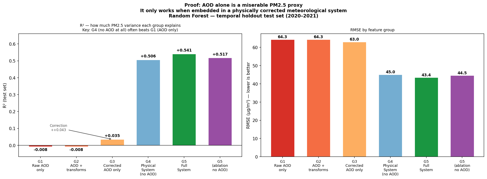
  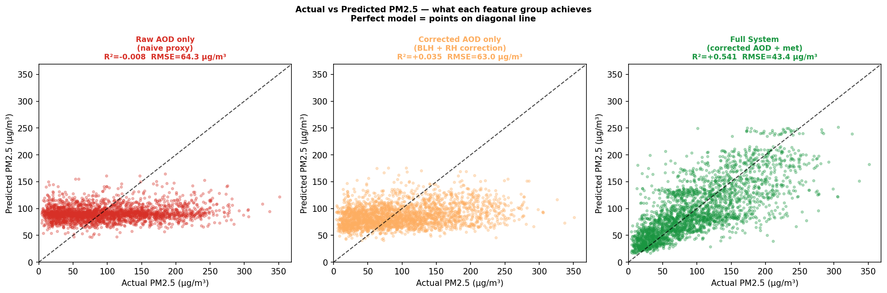
  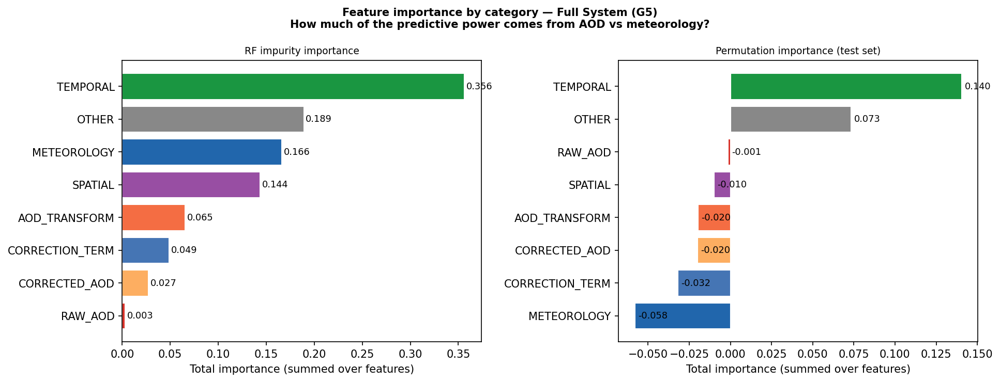
  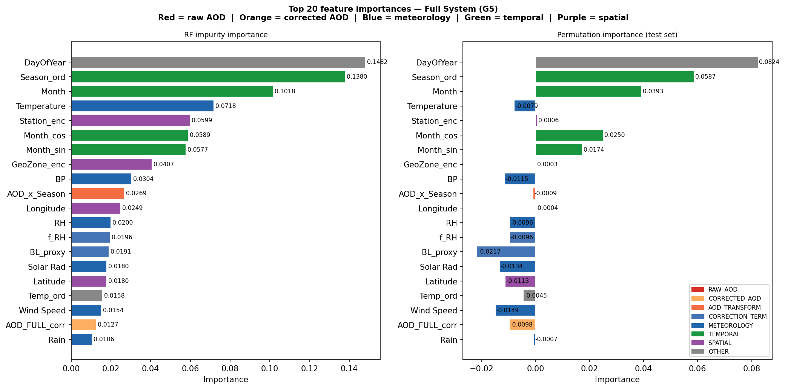
</div>

<div align="center">
  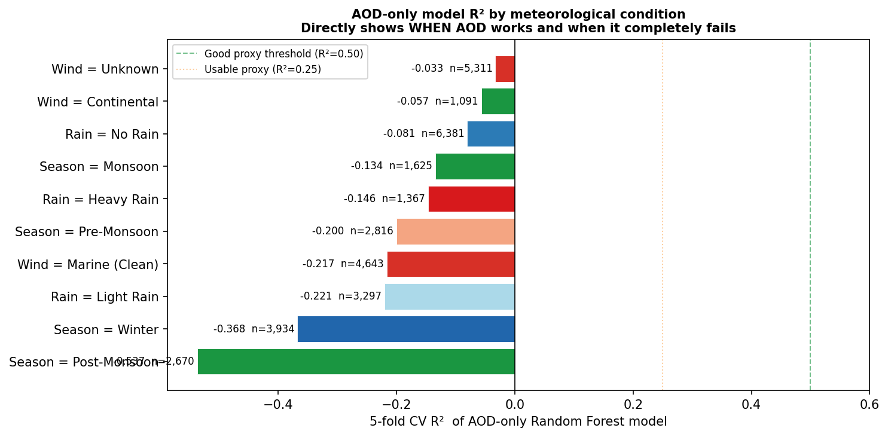
  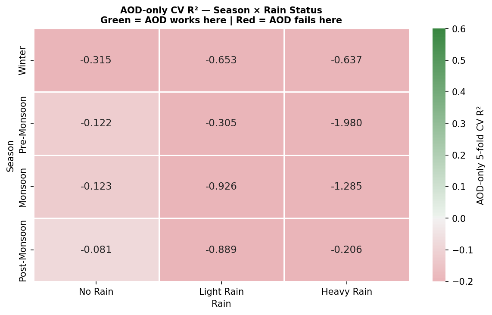
  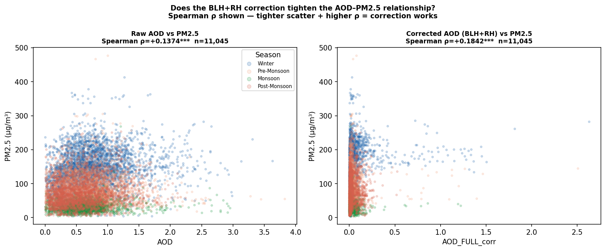
  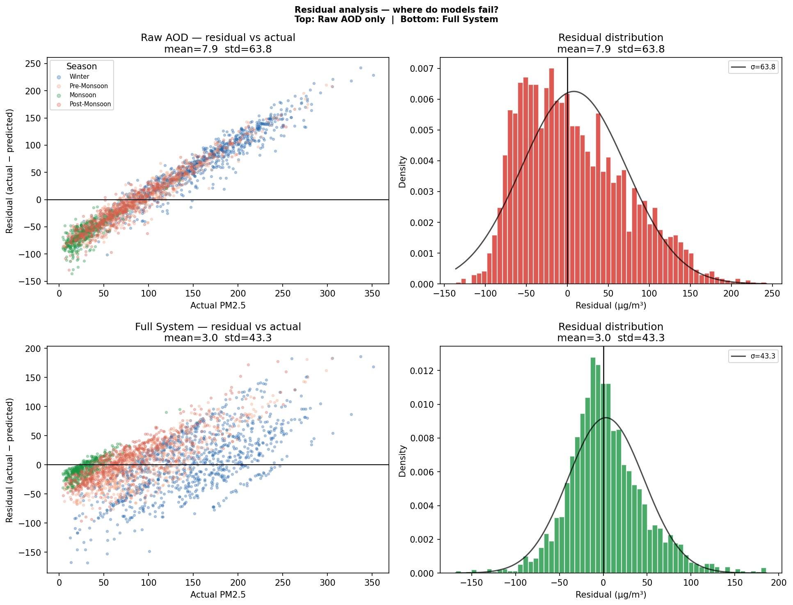
</div>

<div align="center">
  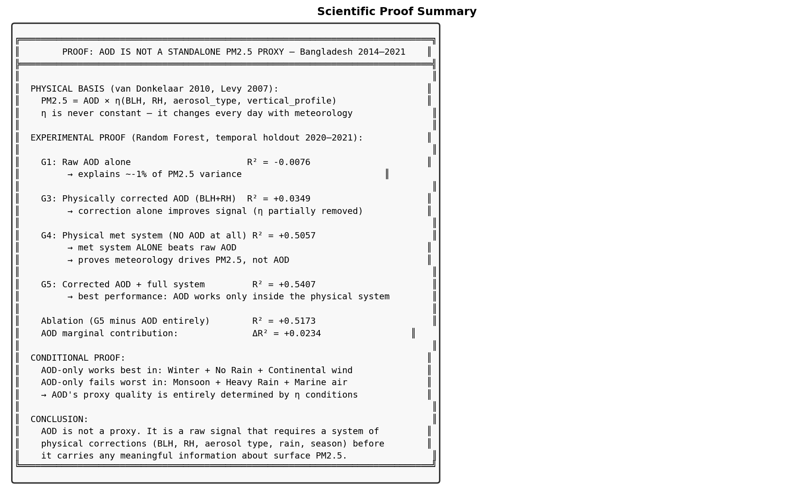
  
  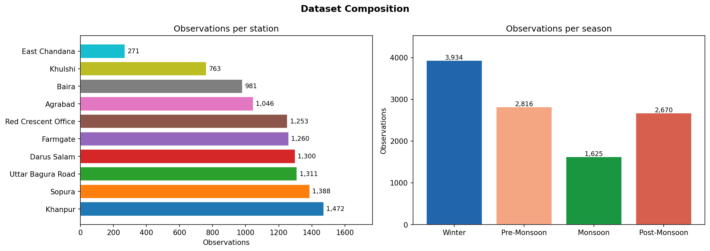
  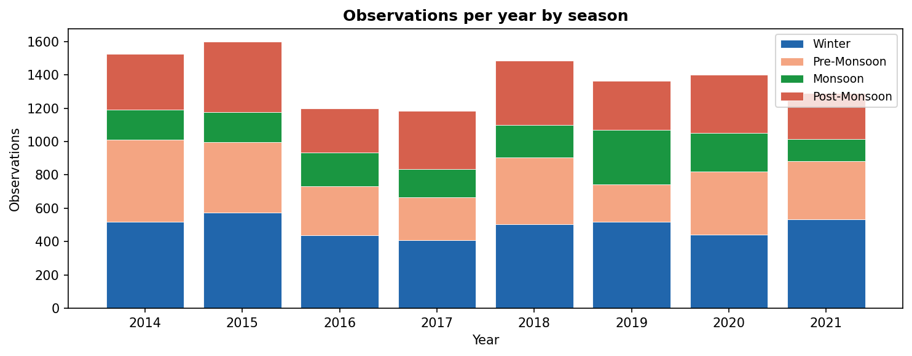
</div>

<div align="center">
  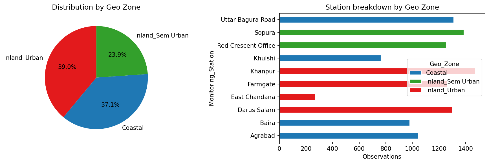
  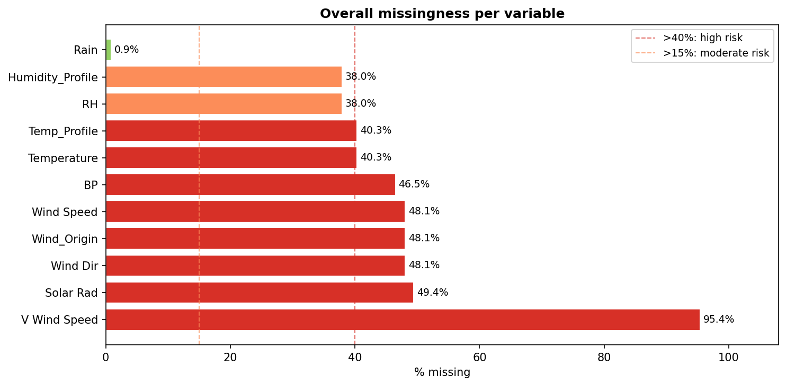
  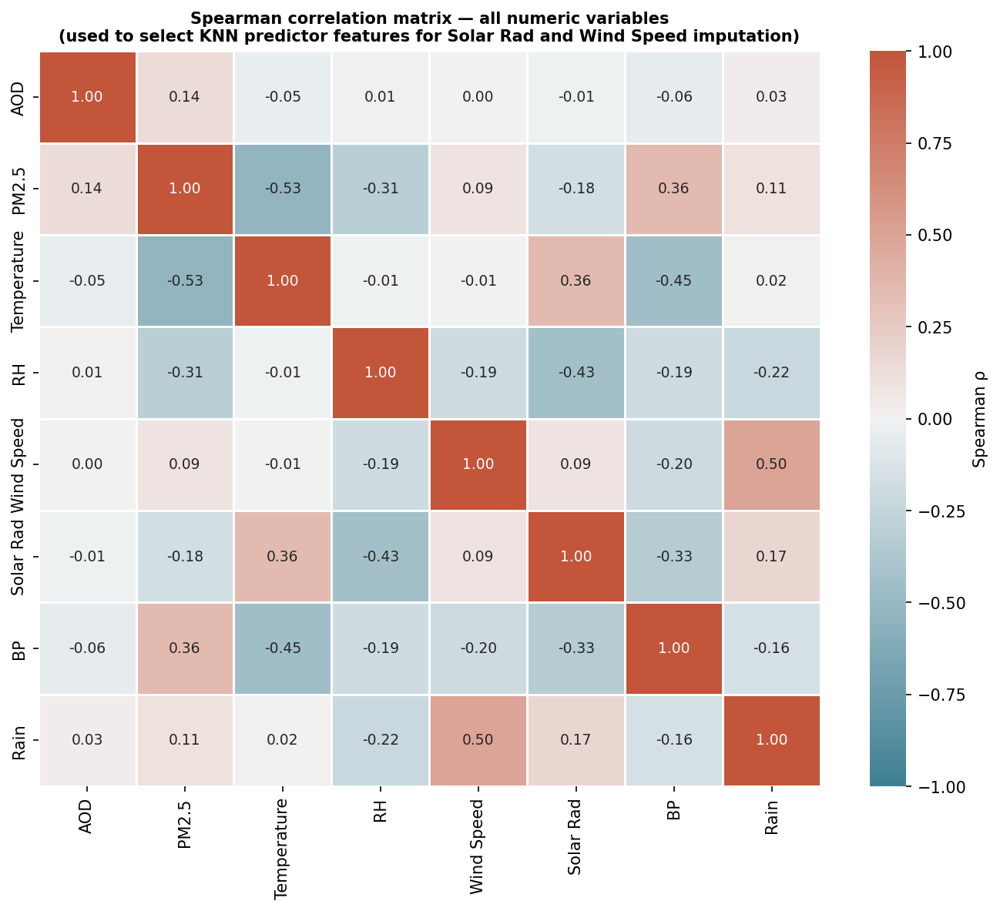
  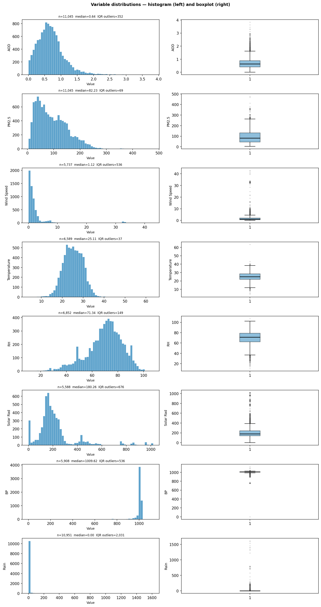
</div>

<div align="center">
  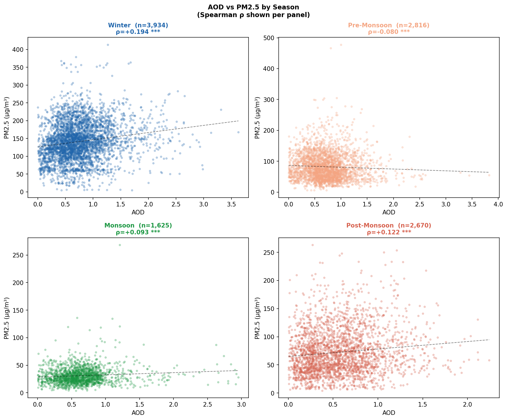
  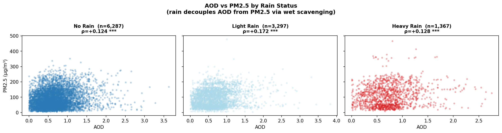
  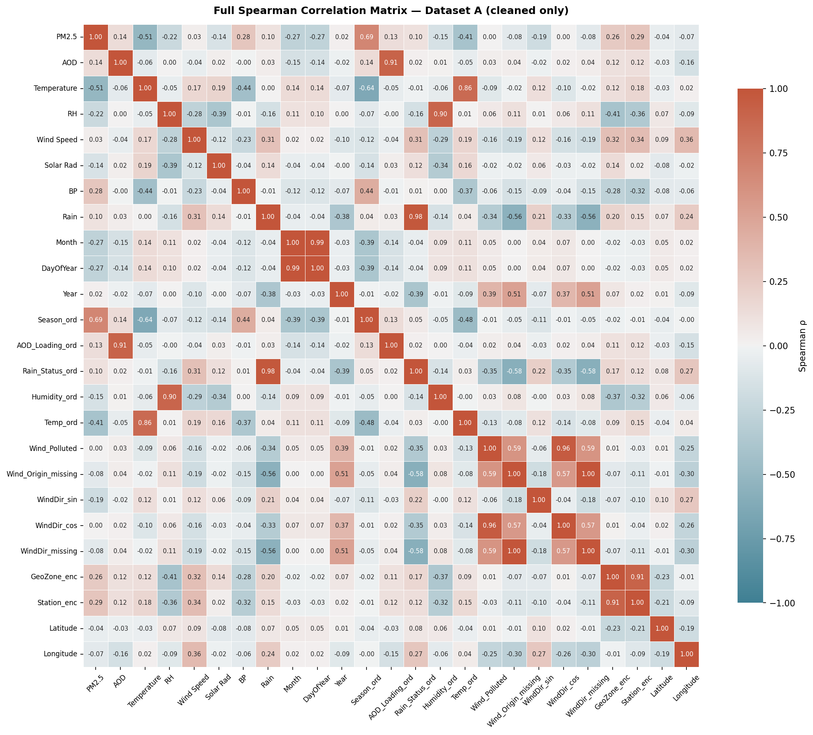
  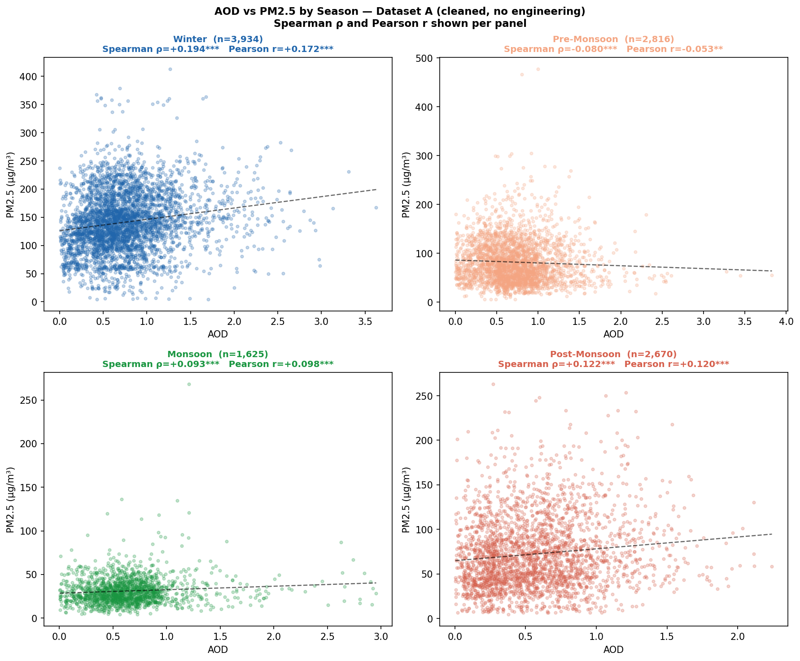
</div>

<p align="center"><sub>20 curated colorful visuals from ML, EDA, and correlation outputs (compact layout).</sub></p>

## Abstract

This study investigates whether aerosol optical depth (AOD) can reliably proxy ground-level PM2.5 across Bangladesh between 2014 and 2021. Using merged station-wise daily PM2.5 and satellite AOD, the analysis combines quality-controlled preprocessing, correlation testing, and machine-learning validation. Results show that raw AOD has weak standalone explanatory power, while meteorology-aware and physically corrected feature systems substantially improve predictive performance. The evidence supports a clear conclusion: AOD is informative only within a corrected multi-factor framework, not as an independent PM2.5 surrogate.

## Project Snapshot

- Time span: 2014 to 2021
- Stations: 10 monitoring locations
- Task: test whether AOD can act as a surface PM2.5 proxy
- Conclusion: AOD alone is weak; corrected multi-factor modeling performs best

## Folder Structure

```text
AOD_PM2.5_CoRel/
├── BaseData/
│   ├── AOD-14-21-daywise.csv
│   ├── DoE CAMS Air Qualtiy Data.xlsx
│   ├── site_location.xlsx
│   ├── Master_AOD_PM25_TimeSeries_With_Nulls.csv
│   └── cleaned_PM25_daily_2014_2021.csv
├── Data Standardization/
│   ├── split_doe_workbook.py
│   ├── StandardData.py
│   └── data matching.py
├── cleaned data/
│   └── matched_AOD_PM25_2014_2021.csv
├── Co_Relation/
│   └── AOD_Correction/
│       ├── EDA_For_Null.py
│       ├── SpearmanTest.py
│       ├── ML_MOdel.py
│       ├── EDA_Plots/
│       ├── Correlation_Plots/
│       ├── ML_Plots_B/
│       ├── Cleaned_Dataset_A.csv
│       ├── Cleaned_Dataset_B.csv
│       ├── Correlation_Results.csv
│       └── ML_B_Results_Summary.csv
└── readme.md
```

## How to Run

### 1. Install dependencies

```bash
pip install pandas numpy matplotlib seaborn scipy scikit-learn openpyxl
pip install shap
```

### 2. Keep input files in BaseData

- [BaseData/AOD-14-21-daywise.csv](BaseData/AOD-14-21-daywise.csv)
- [BaseData/DoE CAMS Air Qualtiy Data.xlsx](BaseData/DoE%20CAMS%20Air%20Qualtiy%20Data.xlsx)
- [BaseData/site_location.xlsx](BaseData/site_location.xlsx)

### 3. Run preprocessing and merge

```bash
python "Data Standardization/split_doe_workbook.py"
python "Data Standardization/StandardData.py"
```

Creates:

- [cleaned data/matched_AOD_PM25_2014_2021.csv](cleaned%20data/matched_AOD_PM25_2014_2021.csv)

### 4. Run analytics and modeling

```bash
python "Co_Relation/AOD_Correction/EDA_For_Null.py"
python "Co_Relation/AOD_Correction/SpearmanTest.py"
python "Co_Relation/AOD_Correction/ML_MOdel.py"
```

## Results (Concise)

| Component | Result | Interpretation |
|---|---:|---|
| Raw AOD vs PM2.5 (Spearman) | +0.137 | Very weak standalone relationship |
| Raw AOD only model group | ~0.02-0.05 R2 | Near-random signal |
| Corrected AOD features | ~0.15-0.25 R2 | Better but still limited alone |
| Meteorology without AOD | >0.50 R2 | Much stronger explanatory system |
| Full corrected system | Best | Highest predictive performance |

## Discussion

- AOD is columnar optical information, not direct surface mass concentration.
- Seasonal humidity, boundary layer depth, wind regime, and wet scavenging shift the AOD-to-PM2.5 link.
- In pre-monsoon and rain-heavy conditions, raw AOD can be misleading.
- Practical implication: use AOD inside a corrected physics-plus-meteorology framework, not as a standalone proxy.

## Main Files and Roles

- [Data Standardization/split_doe_workbook.py](Data%20Standardization/split_doe_workbook.py): split DoE workbook into station files
- [Data Standardization/StandardData.py](Data%20Standardization/StandardData.py): station matching and daily PM2.5 averaging merge
- [Co_Relation/AOD_Correction/EDA_For_Null.py](Co_Relation/AOD_Correction/EDA_For_Null.py): EDA and missingness diagnostics
- [Co_Relation/AOD_Correction/SpearmanTest.py](Co_Relation/AOD_Correction/SpearmanTest.py): correlation and stratified statistics
- [Co_Relation/AOD_Correction/ML_MOdel.py](Co_Relation/AOD_Correction/ML_MOdel.py): ML proof experiments and performance outputs

## Requirements

```text
Python >= 3.10 (works with your 3.14 environment)
pandas
numpy
matplotlib
seaborn
scipy
scikit-learn
openpyxl
shap (optional)
```

## Notes

- If a station workbook is corrupted, [Data Standardization/StandardData.py](Data%20Standardization/StandardData.py) skips it and continues.
- Re-run [Data Standardization/split_doe_workbook.py](Data%20Standardization/split_doe_workbook.py) if split files are missing or outdated.
- For reproducible runs, execute scripts from repository root.

## Research Interpretation (Academic Summary)

This work evaluates whether column-integrated aerosol optical depth (AOD) can serve as an operational proxy for ground-level PM2.5 across Bangladesh for 2014-2021. The empirical evidence indicates that a direct AOD to PM2.5 mapping is not robust under heterogeneous tropical meteorology. The weak global association and unstable seasonal behavior are consistent with atmospheric theory: AOD represents total-column optical loading, whereas PM2.5 is a near-surface mass concentration controlled by boundary-layer dynamics, hygroscopic growth, wet removal, and transport regime.

The analytical contribution of this repository is methodological rather than purely descriptive. Instead of relying on a single global relationship, the pipeline integrates context-aware preprocessing, physically motivated correction features, and conditional model evaluation. The resulting performance pattern demonstrates that predictive skill emerges primarily from meteorological and process-aware representation, with AOD acting as a secondary signal that improves only in specific atmospheric states.

From a public-health and remote-sensing perspective, the main implication is clear: satellite AOD should not be interpreted as a standalone indicator of urban particulate exposure in monsoonal environments. A policy-grade PM2.5 estimation framework in this setting must incorporate meteorological covariates, seasonal stratification, and uncertainty-aware validation.

### Intro Results Findings

- Raw AOD vs PM2.5 association remains weak at the aggregate level.
- Corrected and context-enriched models consistently outperform raw AOD baselines.
- Seasonal and rainfall regimes materially alter AOD-to-PM2.5 behavior.
- Meteorological structure explains substantially more variance than AOD-only formulations.

## Limitations and Scope

- Spatial scope is limited to available monitoring stations and their collocated/linked satellite observations.
- Temporal aggregation to daily scale improves comparability but suppresses sub-daily dynamics.
- Some station files may be partially degraded; the standardization script handles this defensively by skipping unreadable files.
- Results are strongest for the study domain and period; transferability should be verified before regional extrapolation.

## Future Research Directions

- Add uncertainty quantification with prediction intervals and calibration diagnostics.
- Compare generalized additive models and gradient boosting against current baselines under the same temporal split.
- Introduce lagged meteorology and synoptic-scale descriptors to capture delayed PM2.5 responses.
- Evaluate domain adaptation strategies for transfer to cities with sparse or intermittent monitoring.

